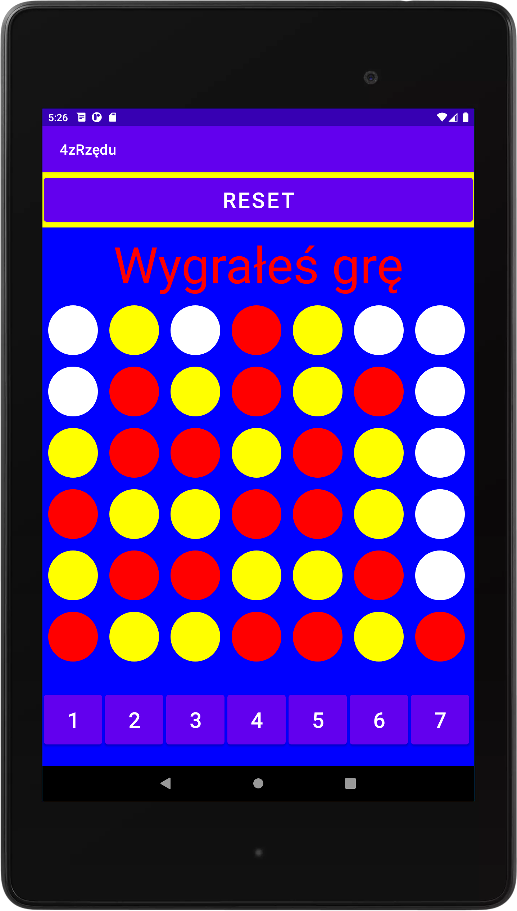

# 4zRzdu
Gra polega na ułożeniu czterech obok siebie krążków tego samego koloru: pionowo, poziomo bądź na ukos. 
Tworzona w środowisku programistycznym Android Studio i testowana pod urządzeniem o rozdzielczości 1200x1920.

